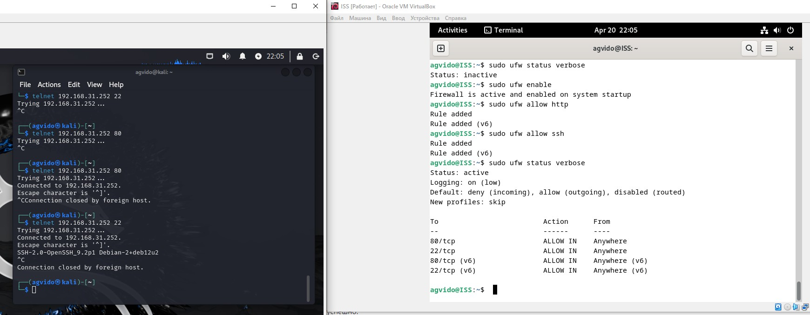
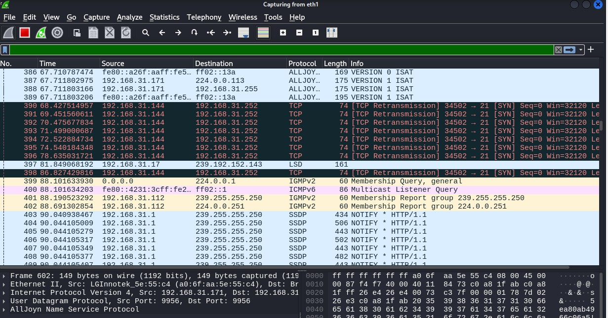
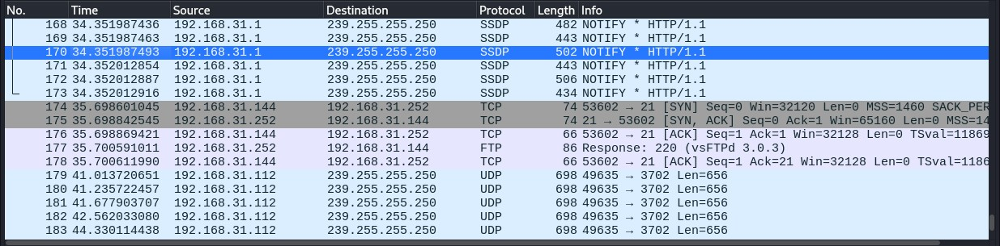

# Домашнее задание к занятию «Протоколы транспортного уровня: TCP, UDP»

В качестве результата пришлите ответы на вопросы в личном кабинете студента на сайте [netology.ru](https://netology.ru).

## Задание Firewall


В качестве результата работы пришлите вывод команды `sudo ufw status verbose`.



```bash


```

## Задание Wireshark

Откройте в Kali Wireshark и проследите, как происходит процесс соединения при отключенном МЭ и при включенном (на 21 порт не стоит `allow`).

В качестве ответа опишите разницу в процессе установления соединения (или попытках установления соединения) при отключенном МЭ и при включенном МЭ (на 21 порт не стоит `allow`).



```bash
```


